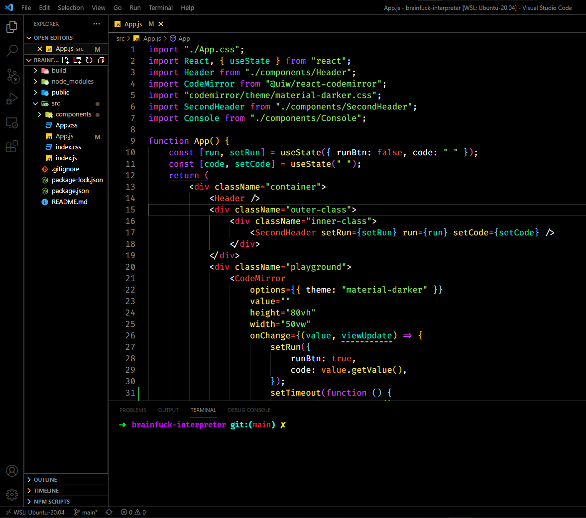

Made a VS-Code theme by combining two of my favorite Theme

-   Border-Scheme from **Monokai High-Contrast (gray)**
-   Color-Scheme from **Andromeda-colorizer**

## Installation

Go to vs-code extensions and search **IfteTheme**. Click Install button.

Or

Visit [IfteTheme](https://marketplace.visualstudio.com/items?itemName=IftekharIfat.ifte-dark)

**Enjoy!**
